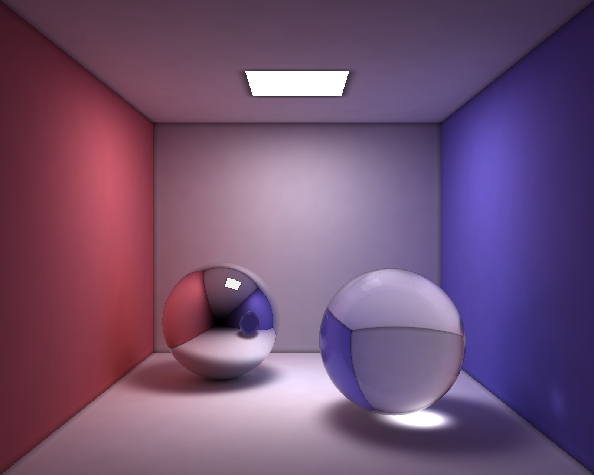
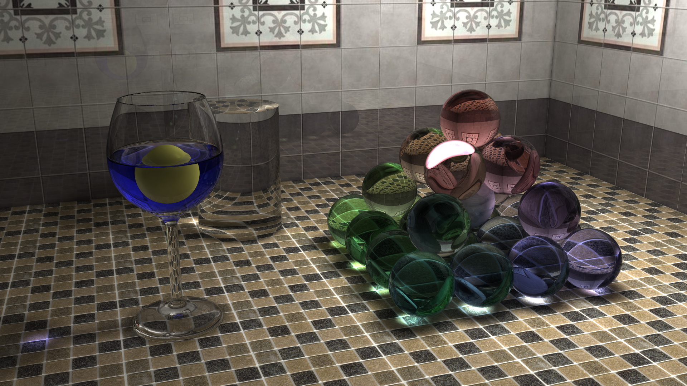
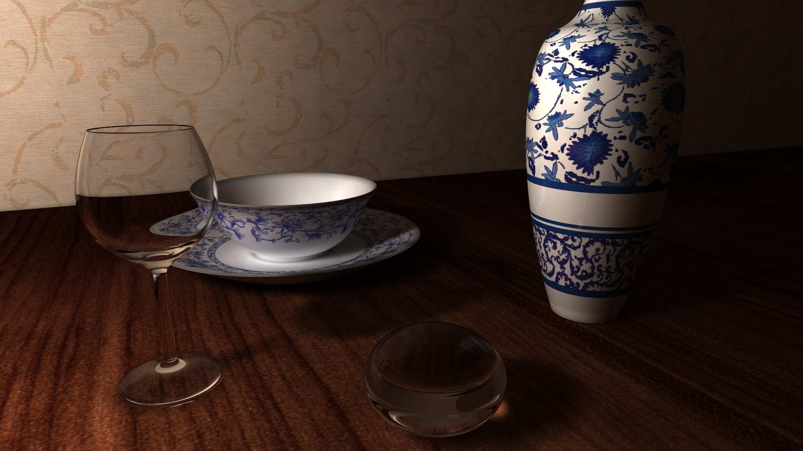
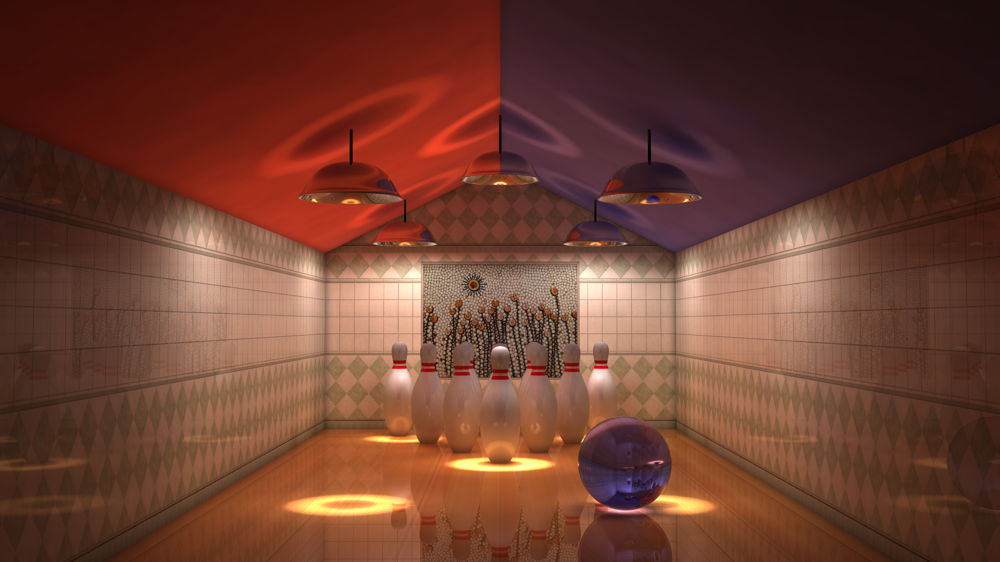

# 3DRender
A simple 3D render engine for Computer Graphics course, based on progressive photon mapping.

## Building
```
mkdir build && cd build
cmake ..
make
```

## Running
### Modeling
```
./modeling <OBJECT_FILE> -o <OUTPUT_FILE>
```

### Render
```
./render [options] <SCENE_FILE> -o <OUTPUT_FILE> -e <ENGINE_ID>
```

Available engine list:

0. Ray tracing (default)
1. Photon mapping
2. Progressive photon papping

## Some Results








